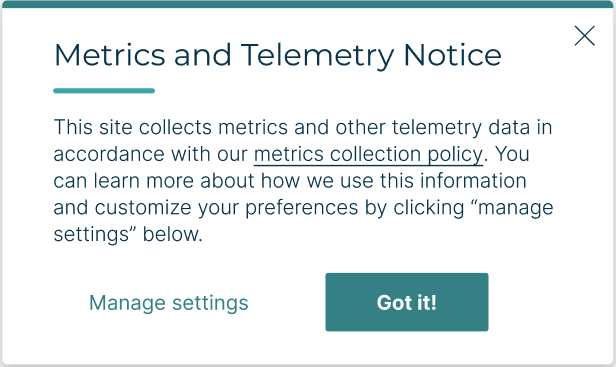
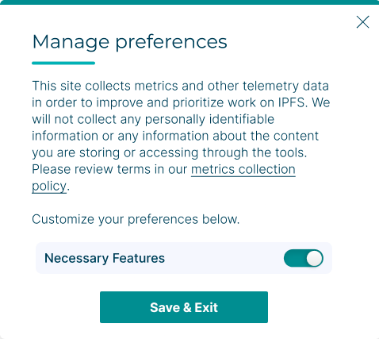

# Telemetry collection policy

This document is the source of truth for our telemetry policies and practices across all Ignite team (IPFS GUI) projects. The discussion held at https://github.com/ipfs/ipfs-gui/issues/125 is the origin and inspiration for this library and all documents under `./docs/telemetry`.

The initial list of projects we're adding telemetry to was originally discussed at https://github.com/ipfs/ipfs-gui/issues/105.

For an up to date list of projects we own that follow this policy, please see:

* https://github.com/ipfs/ipfs-gui#primary-projects
* https://github.com/ipfs/ipfs-gui#other-ipfs-gui--tools-owned-projects

## History

Before 2022Q4, telemetry was only implemented in https://github.com/ipfs/ipfs-webui and https://github.com/ipfs/ipfs-desktop, using our [self-hosted countly](https://count.ly/community-edition) server. The telemetry implemented within ipfs-webui and ipfs-desktop was opt-in only. i.e. metrics data was sent only if a user specifically opted-in to collecting metrics.

Our other projects did not implement telemetry or collection of any metrics data. The only exception was https://github.com/ipfs/ipfs-companion where we have had a [privacy policy since 2019-02-15](https://github.com/ipfs/ipfs-companion/blob/main/PRIVACY-POLICY.md). The privacy policy in ipfs-companion indicates that no data is collected whatsoever, and that will be changing in the future.

## Metrics collection expectations

It's important to clarify that our intention for telemetry gathering within our projects is solely to prioritize our work efforts in improving the most useful features. Telemetry is used for usage analysis and is not violating our users expectations of privacy nor anonymity.

### Application data vs User data

Our telemetry is solely focused on the collection of application data, not user data.

#### What is Application data?

Application data only contains information about events, modules, performance, and use of our applications, not the users themselves.

#### What is User data?

User data can vary across industries and applications, but is generally data that is used to classify or categorize users, typically for targeting classes or categories of users via campaigns or other marketing methods for various purposes. Think demographics, emails, physical addresses, personal preferences, and marketing.

As a general rule, we do not collect user or personal data. See our [Privacy Policy](./PRIVACY_POLICY.md) for more details.

### Metric features and their groupings

The metric features in the first column name and their descriptions come directly from [countly's support website](https://support.count.ly/hc/en-us/articles/360037441932-Web-analytics-JavaScript-#features-for-consent).

| Metric feature name | Consent method | Metric feature group name | Metric feature description                                                     | What do we use this metric for?                                                          |
|:-------------------:|----------------|---------------------------|--------------------------------------------------------------------------------|------------------------------------------------------------------------------------------|
| sessions            | Opt-out        | Minimal                   | tracks when, how often, and how long users use your website                    | For determining unique daily/weekly/monthly active users in order to prioritize projects |
| views               | Opt-out        | Minimal                   | allows for the views/pages accessed by a user to be tracked                    | For tracking application pages and component views only                    |
| events              | Opt-out        | Minimal                   | allows your events to be sent to the server                                    | Timed and one-off application events such as app_start, app_close, function_used, etc. |
| crashes             | Opt-out        | Performance               | allows JavaScript errors to be tracked                                         | Not used yet - Eventually for bug fixes and debugging |
| apm                 | Opt-out        | Performance               | allows performance tracking of application by recording traces                 | Not used yet - Eventually for bug fixes and debugging |
| scrolls             | Opt-out        | UX                        | allows a user’s scrolls to be tracked on the heatmap                           | Not used yet - Possibly for performance and UX optimizations |
| clicks              | Opt-out        | UX                        | allows a user’s clicks and link clicks to be tracked on the heatmap            | Not used yet - Possibly for performance and UX optimizations |
| forms               | Opt-out        | UX                        | allows a user’s form submissions to be tracked                                 | Not used yet - Possibly for bug fixes and debugging, performance and UX optimizations |
| star-rating         | Opt-out        | Feedback                  | allows user rating and feedback tracking through rating widgets                | Not used yet - Possibly for getting user feedback more directly through our applications |
| feedback            | Opt-out        | Feedback                  | allows survey, nps rating and feedback tracking through feedback widgets       | Not used yet - Possibly for getting user feedback more directly through our applications |
| location            | Opt-out        | Location                  | allows a user’s location (country, city area) to be recorded                   | N/A - we have no current need for collecting a user's location data. |
| attribution         | N/A            | N/A                       | allows the campaign from which a user came to be tracked                       | N/A - we do not have any plans to implement or utilize user campaigns |
| users               | N/A            | N/A                       | allows user information, including custom properties, to be collected/provided | N/A - we will not collect user information |

The code implementing these groupings can be found [here](./../../src/MetricsProvider.ts#L17-L30)

**Note:** The above groupings are our global settings. You will want to check the specific `./docs/telemetry/COLLECTED_DATA.md` for for variations.

### What do the consent toggling UIs look like?

Consent toggling has two distinct views depending on the type of application implementing telemetry using this library: Projects without a settings page, and Projects with settings page(s).

Each toggle that a user sees will be tied to a specific "Metric feature group name" as listed in the above table. For now, we don't have any plans to allow more granular control than that, but please [open an issue](https://github.com/ipfs-shipyard/ignite-metrics/issues/new?assignees=&labels=need%2Ftriage&template=open_an_issue.md&title=) if you feel like that should change.

#### Projects without its own settings page(s)

In this case, we would follow the patterns discussed in https://github.com/ipfs/public-gateway-checker/issues/340 and https://github.com/ipfs-shipyard/ignite-metrics/issues/36. See https://pl-strflt.notion.site/Metrics-Collection-and-Consent-Language-0d4059f11d4d474bb76d00539d778d8d#3e2a579c4be043888b1f64bf300048b8 for up to date info.

1. There will be a floating icon at the bottom left of the page:

2. When clicked, that icon will expand into a modal that displays information about our telemetry collection

3. When "manage settings" is clicked, the modal will update to allow you to enable/disable the project's implemented collection of groups of features as defined above in the "Metric features and their groupings" section.

Single toggle Example:

Multi toggle Example:

#### Projects with its own settings page(s)

The consent should conform to the UX expectations of the library it's being implemented in.

##### IPFS-companion

It should look like the rest of the settings in the application.

Potential UI with multiple toggles:

Example with single toggle (PR at https://github.com/ipfs/ipfs-companion/pull/1117):

##### IPFS-Webui & IPFS-Desktop

Analytics toggling and consent notifications are already implemented in the desktop app and webui.

Example:

### Informing users of changes to this policy

We will not display notifications to users regarding telemetry changes, but users can follow release-notes as well as changes to this library, it's telemetry documentation (`./docs/telemetry/*`), and projects implementing this library to stay up to date on our telemetry policy changes.

## SOPs (Standard Operating Procedures)

### Adding telemetry collection to a project without telemetry collection

1. Copy the [COLLECTED_DATA.template](./COLLECTED_DATA.template.md) file to your project at `./docs/telemetry/COLLECTED_DATA.md`
2. Implement the library according to your project's needs
3. Update your `COLLECTED_DATA.md` file specifying exactly which metrics your collecting, and when they're collected.

### Changing what metrics data is collected by a project

When you add/remove metrics data that is collected by a project, you MUST follow this checklist:

1. Fist ask yourself: Are you trying to collect user-identifiable, or other user data at all? STOP.
   * You must get legal approval
   * You must update the following documents:
      * `./PRIVACY_POLICY.md` - responsibility of legal write a new doc after meeting with you and discussing what your plans are. You would then update the `PRIVACY_POLICY.md` in this repo.
      * `./COLLECTION_POLICY.md` - responsibility of you to update according to the changes you're making.
      * `./FAQs.md` - responsibility of you to update clarifying exactly why we're now collecting user data.
1. Modify the project's `./docs/telemetry/COLLECTED_DATA.md` file.
   * Ensure the table under `What metrics data DO we collect` is accurate and up to date

### Changing a metric feature's grouping or opt-in/opt-out policy

When you move a metric feature to/from a particular feature group, or that group changes its consent method, you must update:

1. The table above at `Metric features and their groupings`
2. The code at https://github.com/ipfs-shipyard/ignite-metrics/blob/main/src/CountlyMetrics.ts#L10-L16
3. Possibly the code at https://github.com/ipfs-shipyard/ignite-metrics/blob/main/src/CountlyMetrics.ts#L27-L36

